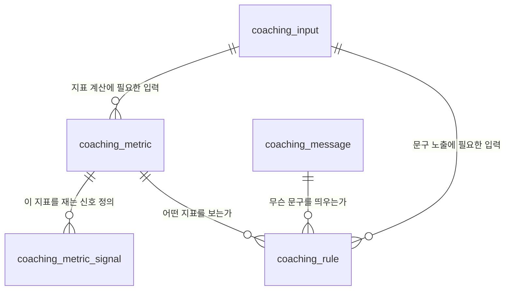

# maiReport 전달용 코칭 테이블 설계 요청서

작성일: 2026-09-04
작성: 개발팀 (Claude 초안)
수신: 의학팀
대상 지식DB: `maireport-knowledge` (2026-09-04 스냅샷 기준)

관련 문서:
- `지식DB_전달테이블_추출_claude.sql` — 이 문서의 5개 테이블을 지식DB에서 자동 추출 (순수 SQL, GUI 클라이언트 가능)
- `지식DB_전달테이블_추출_psql_파일생성_claude.sql` — 위 결과를 CSV·INSERT 파일로 내보내기 (psql 전용)
- `삼성헬스_애플헬스_추가수집항목_claude.md` — §7의 추가 수집 항목을 플랫폼별로 정리

---

## 1. 요청 한 줄 요약

지식DB 전체가 아니라, **maiReport가 사용자 상태만 보고 코칭 문구를 찾을 수 있는 5개 테이블**을 만들어서 데이터와 함께 주세요.
maiReport는 `fact`, `claim`, `package`, `span`, `construct`가 무엇인지 알 필요가 없어야 합니다.

## 2. 왜 이 구조인가

현재 지식DB에서 코칭 하나를 찾으려면 `coaching_line` → `coaching_condition` → `fact` → `measurement_target_intensity` → `measurement_definition` → `coaching_line_event_requirement` → `coaching_axis_observation_rule`을 모두 조인해야 합니다.
게다가 같은 뜻의 조건이 근거 문서 수만큼 중복되어 있습니다. 예를 들어 "주간 중강도 150분 미만"이라는 하나의 상태가 `fact 25 / 43 / 47 / 96`으로 4번 나옵니다(UK CMO, WHO×2, 질병관리청).

maiReport에서는 이것이 **지표 1개 + 규칙 2개**면 충분합니다.

```
[지식DB]  fact 25:below, 43:below, 47:below, 96:below  ─┐
          fact 26:below, 44:below, 48:below            ─┼→ aerobic_below_guideline_start
                                                        │
[전달본]  moderate_minutes_per_week < 150               ─┤
          vigorous_minutes_per_week < 75                ─┘
```

그래서 아래 원칙으로 평탄화했습니다.

| 원칙 | 내용 |
|---|---|
| 용어 제거 | fact / claim / package / span / construct / position(below·within·above) 를 노출하지 않는다 |
| 숫자로 표현 | `position=below` 대신 `value_max = 150` 처럼 **숫자 구간**으로 준다 |
| 중복 제거 | 같은 지표·같은 임계는 근거 문서가 몇 개든 1행으로 합친다 (출처는 `evidence_label` 한 칸에 표기) |
| 계산법 동봉 | "중강도"가 무엇인지(MET 3~5.9 / cadence 100~130 / 최대심박수 50~70%)를 데이터로 준다 |
| 근거 추적은 유지 | 문제가 생기면 되짚을 수 있도록 `source_ref` 칸에 원본 fact_seq / line_id를 남긴다 (maiReport 로직은 이 칸을 읽지 않는다) |

## 3. 구간 표기 규약 (중요)

모든 임계는 **`value_min` 이상, `value_max` 미만** 입니다.

| 표현 | 의미 |
|---|---|
| `value_min = 150`, `value_max = NULL` | 150 이상 (상한 없음) |
| `value_min = NULL`, `value_max = 150` | 150 미만 |
| `value_min = 150`, `value_max = 300` | 150 이상 300 미만 |

- 지식DB의 `[150,300]` 처럼 상한이 포함(닫힘)인 경우가 있습니다. 하지만 현재 데이터에서는 `within`과 `above`가 **같은 문구**로 가므로 경계값 처리 차이가 결과를 바꾸지 않습니다. (예: fact 43은 within/above 모두 `aerobic_volume_is_not_the_lever`)
- 정수 단위(일 수)는 원본 부등호를 정수로 옮겨 적었습니다. 예: 지식DB `(,2]` 초과 → 전달본 `value_min = 3` (운동 세션 간격 3일 이상). 이 변환이 맞는지 **의학팀 확인 필요**(§8-4).

---

## 4. 테이블 5개



| # | 테이블 | 한 줄 설명 | 예상 행 수 |
|---|---|---|---:|
| 1 | `coaching_input` | maiReport가 확보해야 할 입력(센서/질문) 카탈로그 | 8 |
| 2 | `coaching_metric` | 사용자 상태를 나타내는 지표 정의 (무엇을 계산하나) | 9 |
| 3 | `coaching_metric_signal` | 그 지표를 어떤 신호·임계로 재는가 (중강도=MET 3~5.9 등) | 20 |
| 4 | `coaching_message` | 사용자에게 보여줄 문구 | 15 |
| 5 | `coaching_rule` | (지표 구간 + 나이 + 질환) → 문구 매핑. **maiReport의 진입점** | 20 |

> 5개가 많아 보이면 3·5번만 봐도 됩니다. 1·2·3은 "지표를 어떻게 계산하나"를 설명하는 참조 테이블이고, 런타임 조회는 `coaching_rule` → `coaching_message` 두 개로 끝납니다.

---

### 4.1 `coaching_input` — 입력 카탈로그

```sql
CREATE TABLE coaching_input (
  input_key        text PRIMARY KEY,
  display_name     text NOT NULL,
  input_type       text NOT NULL
                   CHECK (input_type IN ('device_daily','device_interval','user_answer','user_profile')),
  question_text_ko text,        -- user_answer 일 때 앱에서 물을 문장
  answer_format    text,        -- user_answer 일 때 기대 형식
  freshness_hours  integer,     -- 이 시간이 지나면 값이 낡은 것으로 본다(의학팀 권장치, 만료 정책 자체는 서비스 몫)
  available_now    boolean NOT NULL,   -- maiReport가 지금 수집 중인가 (개발팀이 채움)
  note             text
);
```

### 4.2 `coaching_metric` — 지표 정의

```sql
CREATE TABLE coaching_metric (
  metric_key         text PRIMARY KEY,
  display_name       text NOT NULL,
  unit               text NOT NULL,     -- minute / hour / day / step / count
  window_kind        text NOT NULL
                     CHECK (window_kind IN ('day','night','rolling_7d','event_gap')),
  min_bout_minutes   numeric,           -- 이 시간 이상 지속된 구간만 센다 (NULL이면 제한 없음)
  max_bout_minutes   numeric,           -- 이 시간 미만인 구간만 센다 (NULL이면 제한 없음)
  required_input_key text REFERENCES coaching_input(input_key),
  computable_now     boolean NOT NULL,  -- 현재 maiReport 수집 데이터로 계산 가능한가 (개발팀이 채움)
  description        text NOT NULL
);
```

### 4.3 `coaching_metric_signal` — 지표를 재는 신호

한 지표를 여러 방법으로 잴 수 있습니다. maiReport는 **확보 가능한 신호 중 `priority`가 가장 작은 것**을 씁니다.

```sql
CREATE TABLE coaching_metric_signal (
  metric_key    text NOT NULL REFERENCES coaching_metric(metric_key),
  signal_key    text NOT NULL,      -- met / cadence / pct_hrmax / asleep_minutes / step_total ...
  signal_min    numeric,            -- 이상
  signal_max    numeric,            -- 미만
  signal_unit   text NOT NULL,
  priority      integer NOT NULL,   -- 작을수록 먼저 시도
  required_input_key text REFERENCES coaching_input(input_key),
  formula       text,               -- 계산이 필요한 경우 (예: HRmax = 220 - age)
  note          text,
  PRIMARY KEY (metric_key, signal_key)
);
```

### 4.4 `coaching_message` — 문구

```sql
CREATE TABLE coaching_message (
  message_id   text PRIMARY KEY,
  title        text NOT NULL,      -- 사용자에게 보이는 제목
  body         text NOT NULL,      -- 사용자에게 보이는 본문
  topic        text NOT NULL,      -- activity / sleep / postmeal / sedentary / recovery
  source_ref   text                -- 원본 coaching_line.line_id (추적용, maiReport 로직은 안 씀)
);
```

### 4.5 `coaching_rule` — 조건 → 문구 (maiReport 진입점)

```sql
CREATE TABLE coaching_rule (
  rule_id            text PRIMARY KEY,
  rule_group         text NOT NULL,   -- 같은 그룹에서는 priority 최소 1건만 노출한다
  priority           integer NOT NULL,-- 작을수록 우선

  -- 대상
  health_condition   text NOT NULL
                     CHECK (health_condition IN ('general','diabetes','pneumonia_recovery')),
  requires_confirmed_diagnosis boolean NOT NULL DEFAULT false,
  age_min            integer,         -- 이상 (NULL = 제한 없음)
  age_max            integer,         -- 미만 (NULL = 제한 없음)

  -- 조건
  trigger_type       text NOT NULL CHECK (trigger_type IN ('metric_range','condition_only')),
  metric_key         text REFERENCES coaching_metric(metric_key),  -- condition_only 이면 NULL
  value_min          numeric,         -- 이상
  value_max          numeric,         -- 미만

  -- 관찰 규칙 (여러 날을 어떻게 묶어 판정하나)
  eval_window_days   integer NOT NULL DEFAULT 1,
  min_observed_days  integer NOT NULL DEFAULT 1,
  min_match_ratio    numeric,         -- 관찰일 중 조건 충족 비율이 이 값 "초과"여야 함. NULL이면 집계값 1개로 판정

  -- 노출 전제
  context_input_key  text REFERENCES coaching_input(input_key),  -- 이 입력이 없으면 문구를 띄우지 않는다
  safety_gate        text,            -- 서비스가 별도로 확인해야 할 안전 조건

  message_id         text NOT NULL REFERENCES coaching_message(message_id),
  evidence_label     text NOT NULL,   -- 화면/로그 표기용 출처 요약
  source_ref         text,            -- 원본 fact_seq:position (추적용)
  is_active          boolean NOT NULL DEFAULT true
);
```

**maiReport 판정 순서**

1. 사용자 나이·확진 상태로 `health_condition` / `age_min` / `age_max` 필터
2. `trigger_type='metric_range'`면 지표값이 `[value_min, value_max)`에 드는지 확인
3. `eval_window_days` 안에 `min_observed_days` 이상 관찰됐는지 확인. `min_match_ratio`가 있으면 충족 비율이 그 값을 **초과**하는지 확인
4. `context_input_key`가 있으면 그 입력이 유효기간(`freshness_hours`) 안에 있는지 확인
5. `safety_gate`가 있으면 서비스 게이트 통과 여부 확인
6. 남은 규칙을 `rule_group`별로 묶어 `priority` 최소 1건만 채택
7. 같은 `message_id`가 여러 번 나오면 1회만 노출

---

## 5. 샘플 데이터

아래는 **2026-09-04 지식DB에 실제로 들어있는 내용**을 위 구조로 옮긴 것입니다.
형식 예시일 뿐 아니라 그대로 1차 전달본으로 쓸 수 있게 만들었습니다. 값이 틀린 곳은 의학팀이 고쳐주세요.

### 5.1 `coaching_input` (8행)

| input_key | display_name | input_type | question_text_ko | freshness_hours | available_now |
|---|---|---|---|---:|:---:|
| `birth_date` | 생년월일 | user_profile | 생년월일을 알려주세요 | – | ❌ |
| `confirmed_condition` | 확진 질환 | user_answer | 의사에게 진단받으신 질환이 있나요? | 720 | ❌ |
| `daily_step_total` | 하루 총 걸음수 | device_daily | – | 24 | ✅ |
| `sleep_session` | 수면 세션 | device_daily | – | 24 | ✅ |
| `activity_interval` | 활동 구간 샘플 | device_interval | – | 24 | ❌ |
| `exercise_session` | 운동 세션 | device_interval | – | 168 | ❌ |
| `meal_event` | 식사 시각 | user_answer | 오늘 점심은 몇 시에 드셨나요? | 12 | ❌ |
| `sedentary_bout` | 좌식 구간 | device_interval | – | 24 | ❌ |

- `available_now`는 개발팀이 채운 값입니다(현재 `HealthDailyRecord` 기준). ❌인 항목이 §7의 추가 수집 대상입니다.
- `meal_event.answer_format` 제안: `{"start":"HH:MM","meal_label":"breakfast/lunch/dinner"}`. 탄수화물량·음식 종류는 첫 계약에 넣지 않습니다.
- `meal_event`의 `freshness_hours=12`는 제안값입니다. 미응답 질문 만료·재질문 큐는 서비스 정책으로 구현합니다(지식DB 범위 밖).

### 5.2 `coaching_metric` (9행)

| metric_key | display_name | unit | window_kind | bout(min~max) | required_input | computable_now |
|---|---|---|---|---|---|:---:|
| `moderate_minutes_per_week` | 주간 중강도 활동 시간 | minute | rolling_7d | – | `activity_interval` | ❌ |
| `vigorous_minutes_per_week` | 주간 고강도 활동 시간 | minute | rolling_7d | – | `activity_interval` | ❌ |
| `mvpa_minutes_per_week` | 주간 중강도이상 활동 시간 | minute | rolling_7d | – | `activity_interval` | ❌ |
| `mvpa_minutes_per_day` | 하루 중강도이상 활동 시간 | minute | day | – | `activity_interval` | ✅ |
| `mvpa_days_per_week` | 주간 활동일수 | day | rolling_7d | 10 ~ – | `activity_interval` | ❌ |
| `days_between_exercise_sessions` | 최근 운동 세션 간격 | day | event_gap | 10 ~ – | `exercise_session` | ❌ |
| `sleep_hours_per_night` | 야간 수면 시간 | hour | night | – | `sleep_session` | ✅ |
| `short_brisk_bouts_per_day` | 짧고 빠른 보행 구간 수 | count | day | 1 ~ 10 | `activity_interval` | ❌ |
| `daily_steps` | 하루 총 걸음수 | step | day | – | `daily_step_total` | ✅ |

- `mvpa_days_per_week` / `days_between_exercise_sessions`의 `min_bout_minutes = 10`: 지식DB가 "운동한 날/세션"을 **10분 이상 지속된 구간**으로 정의합니다(원본 fact 152).
- `short_brisk_bouts_per_day`의 `1 ~ 10`: 1분 이상 10분 미만인 **단일 샘플**만 셉니다. 샘플 사이를 이어붙이면 안 됩니다.
- `daily_steps`는 현재 매칭되는 규칙이 없습니다. §8-1 참고.
- `mvpa_minutes_per_week = moderate + vigorous`로 계산해도 되는지는 §8-3 확인 사항입니다.

### 5.3 `coaching_metric_signal` (18행)

| metric_key | signal_key | min | max | unit | prio | formula |
|---|---|---:|---:|---|---:|---|
| `moderate_minutes_per_week` | `met` | 3 | 5.9 | MET | 1 | – |
| `moderate_minutes_per_week` | `cadence` | 100 | 130 | steps_per_min | 2 | 구간 걸음수 ÷ 구간 분 |
| `moderate_minutes_per_week` | `pct_hrmax` | 50 | 70 | percent_hrmax | 3 | `HRmax = 220 - 나이` |
| `vigorous_minutes_per_week` | `met` | 6 | – | MET | 1 | – |
| `vigorous_minutes_per_week` | `cadence` | 130 | – | steps_per_min | 2 | 구간 걸음수 ÷ 구간 분 |
| `vigorous_minutes_per_week` | `pct_hrmax` | 70 | – | percent_hrmax | 3 | `HRmax = 220 - 나이` |
| `mvpa_minutes_per_week` | `met` | 3 | – | MET | 1 | – |
| `mvpa_minutes_per_week` | `cadence` | 100 | – | steps_per_min | 2 | – |
| `mvpa_minutes_per_day` | `met` | 3 | – | MET | 1 | – |
| `mvpa_minutes_per_day` | `cadence` | 100 | – | steps_per_min | 2 | – |
| `mvpa_days_per_week` | `met` | 3 | – | MET | 1 | – |
| `mvpa_days_per_week` | `cadence` | 100 | – | steps_per_min | 2 | – |
| `days_between_exercise_sessions` | `met` | 3 | – | MET | 1 | – |
| `days_between_exercise_sessions` | `cadence` | 100 | – | steps_per_min | 2 | – |
| `short_brisk_bouts_per_day` | `met` | 3 | – | MET | 1 | – |
| `short_brisk_bouts_per_day` | `cadence` | 100 | – | steps_per_min | 2 | – |
| `sleep_hours_per_night` | `asleep_minutes` | – | – | minute | 1 | `수면시간 ÷ 60` |
| `daily_steps` | `step_total` | – | – | step | 1 | 보정된 하루 총량만 사용 |

> 강도 정의의 출처가 문서마다 다릅니다. MET/cadence는 WHO 2020·UK CMO 2019·cadence 리뷰에서, `pct_hrmax(50~70%)`는 질병관리청 지침에서 왔습니다. **동일 지표에 세 정의를 섞어 써도 되는지 §8-3에서 확인 부탁드립니다.**

### 5.4 `coaching_message` (15행)

| message_id | topic | title |
|---|---|---|
| `aerobic_below_guideline_start` | activity | 유산소 운동을 조금 늘려볼까요? |
| `aerobic_volume_is_not_the_lever` | activity | 오늘은 운동 시간을 더 늘리지 않아도 돼요 |
| `general_regular_short_sleep_duration` | sleep | 최근 수면 시간이 자주 7시간 아래로 내려가요 |
| `general_short_ambulatory_mvpa_proxy` | activity | 짧게 빠르게 움직인 시간이 있었어요 |
| `dm_below_guideline_glycemia` | activity | 조금 더 움직이면 혈당 조절에 도움이 돼요 |
| `dm_daily_short_of_target_move_after_meals` | postmeal | 오늘은 목표만큼 못 움직였어요 — 식사 후에 움직여 볼까요? |
| `dm_shift_walking_to_after_meals` | postmeal | 같은 30분이라면 식후에 나눠 걸어보세요 |
| `dm_plan_postmeal_activity` | postmeal | 식사 뒤에 움직일 시간을 미리 잡아볼까요? |
| `dm_walk_after_meal_instead_of_sitting` | postmeal | 식사 뒤에는 앉아만 있기보다 걸어보세요 |
| `dm_start_soon_after_meal` | postmeal | 식사 후에 움직일 거라면 되도록 일찍 시작해 보세요 |
| `dm_few_active_days_try_short_bouts` | activity | 운동한 날이 권고보다 적어요 — 1분씩 아주 힘들게, 짧게라도 해볼까요? |
| `dm_gap_between_sessions_too_long` | activity | 운동을 몰아서 하기보다 사이를 좁혀볼까요? |
| `dm_break_up_prolonged_sitting` | sedentary | 한참 앉아 있게 되는 날엔 30분마다 잠깐 걸어보세요 |
| `pneumonia_recovery_lower_intensity` | recovery | 회복 중엔 강도를 평소보다 낮춰요 |
| `pneumonia_rise_slowly_after_lying` | recovery | 한참 누워 있다 일어날 땐 천천히 일어나 보세요 |

> `body`(본문)는 지식DB `coaching_line.detail` 원문을 그대로 씁니다. 길이가 길어 표에서는 생략했고 §6 INSERT 스크립트에 전문이 있습니다.

### 5.5 `coaching_rule` (20행)

**일반 성인 (general)** — `requires_confirmed_diagnosis = false`

| rule_id | group | prio | age | 조건 | 관찰 | 필요 입력 | → message |
|---|---|---:|---|---|---|---|---|
| `r_gen_moderate_met` | aerobic_volume | 10 | 18~ | 주간 중강도 **≥150분** | 7일/7일 | – | `aerobic_volume_is_not_the_lever` |
| `r_gen_vigorous_met` | aerobic_volume | 10 | 18~ | 주간 고강도 **≥75분** | 7일/7일 | – | `aerobic_volume_is_not_the_lever` |
| `r_gen_moderate_low` | aerobic_volume | 20 | 18~ | 주간 중강도 **<150분** | 7일/7일 | – | `aerobic_below_guideline_start` |
| `r_gen_vigorous_low` | aerobic_volume | 20 | 18~ | 주간 고강도 **<75분** | 7일/7일 | – | `aerobic_below_guideline_start` |
| `r_gen_sleep_short` | sleep_duration | 10 | 18~65 | 야간 수면 **<7시간** | 7일 중 5밤 관찰, 과반(>0.5) 충족 | `sleep_session` | `general_regular_short_sleep_duration` |
| `r_gen_short_brisk_bout` | activity_moment | 10 | 18~ | 짧고 빠른 보행 구간 **≥1회** | 1일 | `activity_interval` | `general_short_ambulatory_mvpa_proxy` |

> `aerobic_volume` 그룹의 priority 설계: **하나라도 충족하면(prio 10) "더 안 늘려도 된다"가 이깁니다.** 예) 중강도 200분 + 고강도 0분 → `r_gen_moderate_met`(10)이 `r_gen_vigorous_low`(20)를 이겨 "늘리지 않아도 돼요"가 나갑니다. 가이드라인이 중강도/고강도를 대체 가능하게 보기 때문인데, **이 우선순위가 맞는지 §8-3에서 확인 부탁드립니다.**

**2형 당뇨 (diabetes)** — 모두 `requires_confirmed_diagnosis = true`, 나이 제한 없음

| rule_id | group | prio | 조건 | 필요 입력 | 안전 게이트 | → message |
|---|---|---:|---|---|---|---|
| `r_dm_moderate_met` | dm_weekly_volume | 10 | 주간 중강도 ≥150분 | `meal_event` | – | `dm_shift_walking_to_after_meals` |
| `r_dm_mvpa_met` | dm_weekly_volume | 10 | 주간 중강도이상 ≥150분 | `meal_event` | – | `dm_shift_walking_to_after_meals` |
| `r_dm_moderate_low` | dm_weekly_volume | 20 | 주간 중강도 <150분 | – | – | `dm_below_guideline_glycemia` |
| `r_dm_mvpa_low` | dm_weekly_volume | 20 | 주간 중강도이상 <150분 | – | – | `dm_below_guideline_glycemia` |
| `r_dm_daily_met` | dm_daily_volume | 10 | 하루 중강도이상 ≥30분 | `meal_event` | – | `dm_shift_walking_to_after_meals` |
| `r_dm_daily_low` | dm_daily_volume | 20 | 하루 중강도이상 <30분 | `meal_event` | – | `dm_daily_short_of_target_move_after_meals` |
| `r_dm_active_days_low` | dm_active_days | 10 | 주간 활동일수 <3일 | – | 고강도 1분 인터벌 권유 — 심혈관 위험/운동 가능 확인 | `dm_few_active_days_try_short_bouts` |
| `r_dm_session_gap_long` | dm_session_gap | 10 | 운동 세션 간격 ≥3일 | – | – | `dm_gap_between_sessions_too_long` |
| `r_dm_plan_postmeal` | dm_postmeal_habit | 10 | (질환만) | `meal_event` | – | `dm_plan_postmeal_activity` |
| `r_dm_walk_after_meal` | dm_postmeal_habit | 20 | (질환만) | `meal_event` | – | `dm_walk_after_meal_instead_of_sitting` |
| `r_dm_start_soon_after_meal` | dm_postmeal_habit | 30 | (질환만) | `meal_event` | – | `dm_start_soon_after_meal` |
| `r_dm_break_up_sitting` | dm_sedentary | 10 | (질환만) | – | – | `dm_break_up_prolonged_sitting` ⚠️ `is_active=false` |

> `r_dm_break_up_sitting`은 지식DB에 문구는 있으나 좌식 구간 관찰 입력과 아직 연결되어 있지 않습니다. 트리거가 정해질 때까지 `is_active=false`로 두었습니다.
> `dm_postmeal_habit` 그룹의 3개 문구는 모두 "식후에 움직이라"는 같은 계열이라 한 그룹으로 묶어 1개만 노출합니다. 이 묶음이 맞는지 §8-5에서 확인 부탁드립니다.

**폐렴 회복기 (pneumonia_recovery)** — 모두 `requires_confirmed_diagnosis = true`

| rule_id | group | prio | 조건 | 안전 게이트 | → message |
|---|---|---:|---|---|---|
| `r_pn_lower_intensity` | pneumonia_recovery | 10 | (질환만) | 진단 확정 + 회복기 + 활동 가능 확인 | `pneumonia_recovery_lower_intensity` |
| `r_pn_rise_slowly` | pneumonia_recovery | 20 | (질환만) | 진단 확정 + 침상안정/회복기 맥락 | `pneumonia_rise_slowly_after_lying` |

> AI 리포트 소견만으로 `health_condition = 'pneumonia_recovery'`를 켜지 않습니다. 진단 확정과 활동 가능 여부는 서비스가 별도로 확인합니다.

### 5.6 evidence_label / source_ref 매핑

`evidence_label`은 화면·로그 표기용 문자열, `source_ref`는 지식DB 되짚기용 값입니다. maiReport 판정 로직은 두 칸을 읽지 않습니다.

| rule_id | evidence_label | source_ref |
|---|---|---|
| `r_gen_moderate_met` / `r_gen_moderate_low` | WHO 2020 · UK CMO 2019 · 질병관리청 신체활동 지침 | `fact 25,43,47,96` |
| `r_gen_vigorous_met` / `r_gen_vigorous_low` | WHO 2020 · UK CMO 2019 | `fact 26,44,48` |
| `r_gen_sleep_short` | CSEP Canadian 24-Hour Movement Guidelines (성인 18–64) | `fact 40:below` |
| `r_gen_short_brisk_bout` | 짧고 산발적 MVPA 관련 코호트 근거 | `line general_short_ambulatory_mvpa_proxy` |
| `r_dm_moderate_*` | 질병관리청 신체활동 지침 (중등도 = 최대심박수 50–70%) | `fact 133` |
| `r_dm_mvpa_*` | ADA Standards of Care in Diabetes 2026 §5 | `fact 141` |
| `r_dm_daily_*` | ADA Standards of Care in Diabetes 2026 §5 | `fact 168` |
| `r_dm_active_days_low` | ADA Standards of Care in Diabetes 2026 §5 | `fact 142:below` |
| `r_dm_session_gap_long` | ADA Standards of Care in Diabetes 2026 §5 | `fact 150:above` |
| `r_dm_plan_postmeal` 외 식후 3건 | 식후 활동 · 분할 보행 RCT 근거 | `line dm_*` |
| `r_pn_*` | 폐렴 회복기 활동 · 장기 침상안정 기립내성 근거 | `line pneumonia_*` |

---

### 5.7 이 데이터는 자동 추출할 수 있습니다

§5의 5개 테이블은 `지식DB_전달테이블_추출_claude.sql`을 지식DB에 실행하면 그대로 나옵니다. 손으로 옮겨 적을 필요가 없습니다.

**1단계 — 추출 (순수 SQL, pgAdmin·DBeaver·psql 어디서나)**

```
psql -h localhost -p 5432 -U postgres -d maireport-knowledge -f 지식DB_전달테이블_추출_claude.sql
```

`maireport_export` 스키마에 조회용 뷰 8개가 생깁니다. 결과는 이렇게 봅니다.

```sql
SELECT * FROM maireport_export.export_validation;   -- 검증 (ERROR 0건이어야 정상)
SELECT * FROM maireport_export.export_coaching_rule;
SELECT txt FROM maireport_export.export_insert_script ORDER BY ord, sub;  -- 적재 스크립트
```

**2단계 — 파일로 내보내기 (psql 전용, 선택)**

```
psql -h localhost -p 5432 -U postgres -d maireport-knowledge -f 지식DB_전달테이블_추출_psql_파일생성_claude.sql
```

산출물: CSV 5개 + `maireport_coaching_insert.sql`(§6 형식의 적재 스크립트).
GUI 클라이언트를 쓰면 2단계 대신 1단계의 조회 결과를 GUI 내보내기 기능으로 저장하면 됩니다.

지식DB의 `public` 스키마는 읽기만 하고, 쓰기는 새로 만드는 `maireport_export` 스키마 안에서만 일어납니다. 스크립트 첫 줄이 그 스키마를 `DROP`/`CREATE` 하므로 몇 번을 재실행해도 결과가 같습니다.

스크립트가 사람 손으로 관리하는 부분은 `map_*` 테이블 6개뿐입니다(지표 이름, 문구 묶음·우선순위, 입력 카탈로그, 관찰 창, 출처 표기, 질환 매핑). 지식DB에 문구나 fact가 추가되면 나머지는 자동 반영되고, 매핑이 빠진 것은 스크립트의 검증 쿼리 V1~V9가 잡아냅니다.

---

## 6. 전달 스크립트 예시

의학팀에서는 아래 형식(DDL + INSERT 한 파일, 또는 테이블별 CSV 5개)으로 주시면 개발팀이 그대로 maiReport DB에 반영합니다.

```sql
-- ============ coaching_input ============
INSERT INTO coaching_input
 (input_key, display_name, input_type, question_text_ko, answer_format, freshness_hours, available_now, note) VALUES
 ('birth_date','생년월일','user_profile','생년월일을 알려주세요','YYYY-MM-DD',NULL,false,
  '모든 규칙의 나이 조건과 최대심박수(220-나이) 계산에 필요'),
 ('confirmed_condition','확진 질환','user_answer','의사에게 진단받으신 질환이 있나요？','type_2_diabetes | pneumonia_recovery | none',720,false,
  'AI 리포트 소견은 확진이 아니다. 확진 확인 없이 질환 규칙을 켜지 않는다'),
 ('daily_step_total','하루 총 걸음수','device_daily',NULL,NULL,24,true,
  '보정된 하루 총량만 사용. raw StepCount interval을 단순 합산하지 않는다'),
 ('sleep_session','수면 세션','device_daily',NULL,NULL,24,true,
  '밤별 수면 시간. 단일 밤만으로 판정하지 않는다'),
 ('activity_interval','활동 구간 샘플','device_interval',NULL,'start, end, steps | met | heart_rate',24,false,
  '강도별 활동 시간 계산의 필수 입력. 현재 maiReport 미수집'),
 ('exercise_session','운동 세션','device_interval',NULL,'start, end',168,false,
  '세션 간격 계산용. 10분 이상 지속 구간을 1세션으로 본다'),
 ('meal_event','식사 시각','user_answer','오늘 점심은 몇 시에 드셨나요？','{"start":"HH:MM","meal_label":"breakfast|lunch|dinner"}',12,false,
  '최소 계약은 시작 시각만. 탄수화물량·음식 종류는 넣지 않는다'),
 ('sedentary_bout','좌식 구간','device_interval',NULL,'start, end',24,false,
  'dm_break_up_prolonged_sitting 트리거 정교화용. 현재 해당 규칙은 비활성');

-- ============ coaching_metric ============
INSERT INTO coaching_metric
 (metric_key, display_name, unit, window_kind, min_bout_minutes, max_bout_minutes,
  required_input_key, computable_now, description) VALUES
 ('moderate_minutes_per_week','주간 중강도 활동 시간','minute','rolling_7d',NULL,NULL,
  'activity_interval',false,'최근 7일간 중강도 구간의 합(분)'),
 ('vigorous_minutes_per_week','주간 고강도 활동 시간','minute','rolling_7d',NULL,NULL,
  'activity_interval',false,'최근 7일간 고강도 구간의 합(분)'),
 ('mvpa_minutes_per_week','주간 중강도이상 활동 시간','minute','rolling_7d',NULL,NULL,
  'activity_interval',false,'최근 7일간 중강도 이상 구간의 합(분)'),
 ('mvpa_minutes_per_day','하루 중강도이상 활동 시간','minute','day',NULL,NULL,
  'activity_interval',true,'해당 일자 중강도 이상 구간의 합(분)'),
 ('mvpa_days_per_week','주간 활동일수','day','rolling_7d',10,NULL,
  'activity_interval',false,'최근 7일 중 10분 이상 지속된 중강도이상 구간이 하나라도 있는 날의 수'),
 ('days_between_exercise_sessions','최근 운동 세션 간격','day','event_gap',10,NULL,
  'exercise_session',false,'가장 최근 두 운동 세션 사이의 경과 일수'),
 ('sleep_hours_per_night','야간 수면 시간','hour','night',NULL,NULL,
  'sleep_session',true,'해당 밤의 수면 시간(시간)'),
 ('short_brisk_bouts_per_day','짧고 빠른 보행 구간 수','count','day',1,10,
  'activity_interval',false,'1분 이상 10분 미만인 단일 샘플 중 중강도 이상인 구간의 개수. 샘플 사이를 이어붙이지 않는다'),
 ('daily_steps','하루 총 걸음수','step','day',NULL,NULL,
  'daily_step_total',true,'보정된 하루 총 걸음수');

-- ============ coaching_metric_signal ============
INSERT INTO coaching_metric_signal
 (metric_key, signal_key, signal_min, signal_max, signal_unit, priority, required_input_key, formula, note) VALUES
 ('moderate_minutes_per_week','met',3,5.9,'MET',1,'activity_interval',NULL,'중강도 = 3~5.9 MET'),
 ('moderate_minutes_per_week','cadence',100,130,'steps_per_min',2,'activity_interval','구간 걸음수 / 구간 분','중강도 = 100~130 steps/min'),
 ('moderate_minutes_per_week','pct_hrmax',50,70,'percent_hrmax',3,'activity_interval','HRmax = 220 - 나이','중등도 = 최대심박수 50~70%'),
 ('vigorous_minutes_per_week','met',6,NULL,'MET',1,'activity_interval',NULL,'고강도 = 6 MET 이상'),
 ('vigorous_minutes_per_week','cadence',130,NULL,'steps_per_min',2,'activity_interval','구간 걸음수 / 구간 분','고강도 = 130 steps/min 이상'),
 ('vigorous_minutes_per_week','pct_hrmax',70,NULL,'percent_hrmax',3,'activity_interval','HRmax = 220 - 나이','고강도 = 최대심박수 70% 이상'),
 ('mvpa_minutes_per_week','met',3,NULL,'MET',1,'activity_interval',NULL,'중강도 이상 = 3 MET 이상'),
 ('mvpa_minutes_per_week','cadence',100,NULL,'steps_per_min',2,'activity_interval','구간 걸음수 / 구간 분',NULL),
 ('mvpa_minutes_per_day','met',3,NULL,'MET',1,'activity_interval',NULL,NULL),
 ('mvpa_minutes_per_day','cadence',100,NULL,'steps_per_min',2,'activity_interval','구간 걸음수 / 구간 분',NULL),
 ('mvpa_days_per_week','met',3,NULL,'MET',1,'activity_interval',NULL,NULL),
 ('mvpa_days_per_week','cadence',100,NULL,'steps_per_min',2,'activity_interval','구간 걸음수 / 구간 분',NULL),
 ('days_between_exercise_sessions','met',3,NULL,'MET',1,'exercise_session',NULL,NULL),
 ('days_between_exercise_sessions','cadence',100,NULL,'steps_per_min',2,'exercise_session','구간 걸음수 / 구간 분',NULL),
 ('short_brisk_bouts_per_day','met',3,NULL,'MET',1,'activity_interval',NULL,NULL),
 ('short_brisk_bouts_per_day','cadence',100,NULL,'steps_per_min',2,'activity_interval','구간 걸음수 / 구간 분',NULL),
 ('sleep_hours_per_night','asleep_minutes',NULL,NULL,'minute',1,'sleep_session','수면 분 / 60',NULL),
 ('daily_steps','step_total',NULL,NULL,'step',1,'daily_step_total',NULL,'보정된 하루 총량만 사용');

-- ============ coaching_message ============
INSERT INTO coaching_message (message_id, title, body, topic, source_ref) VALUES
 ('aerobic_below_guideline_start',
  '유산소 운동을 조금 늘려볼까요?',
  '유산소 활동을 조금 늘리면 운동 뒤 심박수가 더 빨리 안정되는 데 도움이 되고, 중강도·고강도 유산소 활동을 꾸준히 채우는 것은 심혈관질환 위험을 낮추는 방향으로 권고됩니다. 이번 주에는 할 수 있는 움직임부터 목표 시간에 조금 더 가까워져 보세요.',
  'activity','line:aerobic_below_guideline_start'),
 ('aerobic_volume_is_not_the_lever',
  '오늘은 운동 시간을 더 늘리지 않아도 돼요',
  '운동 시간을 권고보다 더 늘려도 운동 뒤 심박수가 안정되는 속도는 그보다 더 좋아지지 않았어요. 지금 하는 만큼을 꾸준히 이어가는 편이 좋아요.',
  'activity','line:aerobic_volume_is_not_the_lever'),
 ('general_regular_short_sleep_duration',
  '최근 수면 시간이 자주 7시간 아래로 내려가요',
  '성인 수면 권고는 건강을 위해 밤마다 규칙적으로 7시간 이상 자는 것을 말합니다. 최근 관찰된 밤의 과반이 7시간 미만이면, 당분간 취침 시간을 조금 앞당기거나 아침 기상 시간을 무리하게 당기지 않는 쪽으로 수면 기회를 먼저 확보해보세요.',
  'sleep','line:general_regular_short_sleep_duration'),
 ('general_short_ambulatory_mvpa_proxy',
  '짧게 빠르게 움직인 시간이 있었어요',
  '1-10분 미만의 짧은 구간이라도 빠르게 걷는 수준의 움직임은 10분 이상 운동만 의미 있다는 해석에 갇히지 않습니다. 오늘처럼 짧게라도 숨이 조금 찰 만큼 걷는 시간을 발견했다면, 그 흐름을 하루 중 편한 때에 한 번 더 이어가 보세요.',
  'activity','line:general_short_ambulatory_mvpa_proxy'),
 ('dm_below_guideline_glycemia',
  '조금 더 움직이면 혈당 조절에 도움이 돼요',
  '가장 힘껏 했을 때의 절반쯤 되는 세기로 유산소 운동을 하면 하루 중 혈당이 높게 유지되는 시간이 줄어들어요.',
  'activity','line:dm_below_guideline_glycemia'),
 ('dm_daily_short_of_target_move_after_meals',
  '오늘은 목표만큼 못 움직였어요 — 식사 후에 움직여 볼까요?',
  '운동은 식사 전보다 식사 후에 하는 편이 식후 혈당을 더 낮춰요. 시간이 없다면 아주 짧아도 됩니다 — 다만 그때는 「아주 힘들다」고 느낄 만큼 세게 1분씩, 하루 네 번이에요(스텝업이나 제자리 달리기 같은 것).',
  'postmeal','line:dm_daily_short_of_target_move_after_meals'),
 ('dm_shift_walking_to_after_meals',
  '같은 30분이라면 식후에 나눠 걸어보세요',
  '하루 한 번 30분을 몰아서 걷는 것보다, 매 끼니 뒤에 10분씩 나눠 걷는 편이 식후 혈당을 더 낮춰요. 특히 저녁 식사 뒤에 차이가 컸어요.',
  'postmeal','line:dm_shift_walking_to_after_meals'),
 ('dm_plan_postmeal_activity',
  '식사 뒤에 움직일 시간을 미리 잡아볼까요?',
  '식후 활동을 하도록 안내받은 2형 당뇨 성인은 하루 한 번 30분 걷기 안내를 받았을 때보다 식후 혈당이 낮았어요. 특히 저녁처럼 탄수화물을 많이 먹기 쉬운 식사 뒤에는 짧게라도 움직일 시간을 정해두는 편이 좋습니다.',
  'postmeal','line:dm_plan_postmeal_activity'),
 ('dm_walk_after_meal_instead_of_sitting',
  '식사 뒤에는 앉아만 있기보다 걸어보세요',
  '식후 운동은 가만히 앉아 있는 것보다 식후 혈당 상승을 낮췄어요. 식사 뒤에 바로 오래 앉아 있게 될 것 같다면, 걷는 시간을 먼저 잡아두는 편이 좋습니다.',
  'postmeal','line:dm_walk_after_meal_instead_of_sitting'),
 ('dm_start_soon_after_meal',
  '식사 후에 움직일 거라면 되도록 일찍 시작해 보세요',
  '식사와 운동 사이가 길어질수록 식후 혈당을 낮추는 효과가 작아져요. 식사 전에 하는 운동은 식후 혈당에는 도움이 되지 않았고요. 다만 「몇 분 안에」라고 말할 수 있는 기준은 아직 없습니다 — 되도록 이른 편이 낫다는 방향만 말할 수 있어요.',
  'postmeal','line:dm_start_soon_after_meal'),
 ('dm_few_active_days_try_short_bouts',
  '운동한 날이 권고보다 적어요 — 1분씩 아주 힘들게, 짧게라도 해볼까요?',
  '식사 후에 「아주 힘들다」고 느낄 만큼 세게 1분씩, 하루 네 번이면 식후 혈당이 낮아져요. 스텝업이나 제자리 달리기처럼 도구 없이 할 수 있는 움직임이면 됩니다. 권고도 이렇게 강하게 하는 운동이라면 더 짧은 시간(주 75분)으로 대신할 수 있다고 말해요.',
  'activity','line:dm_few_active_days_try_short_bouts'),
 ('dm_gap_between_sessions_too_long',
  '운동을 몰아서 하기보다 사이를 좁혀볼까요?',
  '운동한 날 사이가 이틀 넘게 벌어지지 않게 해보세요. 가장 힘껏 했을 때의 절반쯤 되는 세기로, 매일 30분씩 나눠 해도 되고 이틀에 한 번 60분을 몰아서 해도 괜찮아요 — 두 방식 다 혈당이 높게 유지되는 시간을 줄였어요.',
  'activity','line:dm_gap_between_sessions_too_long'),
 ('dm_break_up_prolonged_sitting',
  '한참 앉아 있게 되는 날엔 30분마다 잠깐 걸어보세요',
  '30분마다 1분 40초씩만 걸어도 식후 혈당과 인슐린이 계속 앉아 있을 때보다 낮아져요. 한 번에 길게 걷는 것보다 짧게 자주 끊는 편이 나았습니다.',
  'sedentary','line:dm_break_up_prolonged_sitting'),
 ('pneumonia_recovery_lower_intensity',
  '회복 중엔 강도를 평소보다 낮춰요',
  '폐렴 회복기에는 숨이 찰 수 있어요. 너무 힘든 활동은 어지러움을 부를 수 있습니다.',
  'recovery','line:pneumonia_recovery_lower_intensity'),
 ('pneumonia_rise_slowly_after_lying',
  '한참 누워 있다 일어날 땐 천천히 일어나 보세요',
  '오래 누워 있다가 갑자기 일어서면 다리 쪽으로 피가 몰려 혈압이 잠깐 떨어져요. 몸이 곧바로 되돌리지만 그 힘이 느리면 어지럽거나 아찔할 수 있습니다. 천천히 일어나면 그 순간을 넘기기 쉬워요.',
  'recovery','line:pneumonia_rise_slowly_after_lying');

-- ============ coaching_rule ============
INSERT INTO coaching_rule
 (rule_id, rule_group, priority, health_condition, requires_confirmed_diagnosis,
  age_min, age_max, trigger_type, metric_key, value_min, value_max,
  eval_window_days, min_observed_days, min_match_ratio,
  context_input_key, safety_gate, message_id, evidence_label, source_ref, is_active) VALUES

 -- 일반 성인: 주간 유산소 총량
 ('r_gen_moderate_met','aerobic_volume',10,'general',false,18,NULL,
  'metric_range','moderate_minutes_per_week',150,NULL, 7,7,NULL,
  NULL,NULL,'aerobic_volume_is_not_the_lever',
  'WHO 2020 · UK CMO 2019 · 질병관리청 신체활동 지침','fact 25,43,47,96 :within/above',true),
 ('r_gen_vigorous_met','aerobic_volume',10,'general',false,18,NULL,
  'metric_range','vigorous_minutes_per_week',75,NULL, 7,7,NULL,
  NULL,NULL,'aerobic_volume_is_not_the_lever',
  'WHO 2020 · UK CMO 2019','fact 26,44,48 :within/above',true),
 ('r_gen_moderate_low','aerobic_volume',20,'general',false,18,NULL,
  'metric_range','moderate_minutes_per_week',NULL,150, 7,7,NULL,
  NULL,NULL,'aerobic_below_guideline_start',
  'WHO 2020 · UK CMO 2019 · 질병관리청 신체활동 지침','fact 25,43,47,96 :below',true),
 ('r_gen_vigorous_low','aerobic_volume',20,'general',false,18,NULL,
  'metric_range','vigorous_minutes_per_week',NULL,75, 7,7,NULL,
  NULL,NULL,'aerobic_below_guideline_start',
  'WHO 2020 · UK CMO 2019','fact 26,44,48 :below',true),

 -- 일반 성인: 수면
 ('r_gen_sleep_short','sleep_duration',10,'general',false,18,65,
  'metric_range','sleep_hours_per_night',NULL,7, 7,5,0.5,
  'sleep_session',NULL,'general_regular_short_sleep_duration',
  'CSEP Canadian 24-Hour Movement Guidelines (성인 18-64)','fact 40:below',true),

 -- 일반 성인: 짧고 빠른 보행 관찰
 ('r_gen_short_brisk_bout','activity_moment',10,'general',false,18,NULL,
  'metric_range','short_brisk_bouts_per_day',1,NULL, 1,1,NULL,
  'activity_interval',NULL,'general_short_ambulatory_mvpa_proxy',
  '짧고 산발적 MVPA 관련 코호트 근거','line:general_short_ambulatory_mvpa_proxy',true),

 -- 2형 당뇨: 주간 총량
 ('r_dm_moderate_met','dm_weekly_volume',10,'diabetes',true,NULL,NULL,
  'metric_range','moderate_minutes_per_week',150,NULL, 7,7,NULL,
  'meal_event',NULL,'dm_shift_walking_to_after_meals',
  '질병관리청 신체활동 지침 (중등도 = 최대심박수 50-70%)','fact 133:within',true),
 ('r_dm_mvpa_met','dm_weekly_volume',10,'diabetes',true,NULL,NULL,
  'metric_range','mvpa_minutes_per_week',150,NULL, 7,7,NULL,
  'meal_event',NULL,'dm_shift_walking_to_after_meals',
  'ADA Standards of Care in Diabetes 2026 §5','fact 141:within',true),
 ('r_dm_moderate_low','dm_weekly_volume',20,'diabetes',true,NULL,NULL,
  'metric_range','moderate_minutes_per_week',NULL,150, 7,7,NULL,
  NULL,NULL,'dm_below_guideline_glycemia',
  '질병관리청 신체활동 지침','fact 133:below',true),
 ('r_dm_mvpa_low','dm_weekly_volume',20,'diabetes',true,NULL,NULL,
  'metric_range','mvpa_minutes_per_week',NULL,150, 7,7,NULL,
  NULL,NULL,'dm_below_guideline_glycemia',
  'ADA Standards of Care in Diabetes 2026 §5','fact 141:below',true),

 -- 2형 당뇨: 하루 총량
 ('r_dm_daily_met','dm_daily_volume',10,'diabetes',true,NULL,NULL,
  'metric_range','mvpa_minutes_per_day',30,NULL, 1,1,NULL,
  'meal_event',NULL,'dm_shift_walking_to_after_meals',
  'ADA Standards of Care in Diabetes 2026 §5','fact 168:within',true),
 ('r_dm_daily_low','dm_daily_volume',20,'diabetes',true,NULL,NULL,
  'metric_range','mvpa_minutes_per_day',NULL,30, 1,1,NULL,
  'meal_event',NULL,'dm_daily_short_of_target_move_after_meals',
  'ADA Standards of Care in Diabetes 2026 §5','fact 168:below',true),

 -- 2형 당뇨: 활동일수 / 세션 간격
 ('r_dm_active_days_low','dm_active_days',10,'diabetes',true,NULL,NULL,
  'metric_range','mvpa_days_per_week',NULL,3, 7,7,NULL,
  NULL,'고강도 1분 인터벌을 권유하는 문구 — 심혈관 위험 평가와 운동 가능 여부 확인 필요',
  'dm_few_active_days_try_short_bouts',
  'ADA Standards of Care in Diabetes 2026 §5','fact 142:below',true),
 ('r_dm_session_gap_long','dm_session_gap',10,'diabetes',true,NULL,NULL,
  'metric_range','days_between_exercise_sessions',3,NULL, 14,2,NULL,
  NULL,NULL,'dm_gap_between_sessions_too_long',
  'ADA Standards of Care in Diabetes 2026 §5','fact 150:above (원문 2일 초과 → 정수 3일 이상)',true),

 -- 2형 당뇨: 식후 습관 (지표 없음, 질환만)
 ('r_dm_plan_postmeal','dm_postmeal_habit',10,'diabetes',true,NULL,NULL,
  'condition_only',NULL,NULL,NULL, 1,1,NULL,
  'meal_event',NULL,'dm_plan_postmeal_activity',
  '식후 활동 안내 RCT 근거','line:dm_plan_postmeal_activity',true),
 ('r_dm_walk_after_meal','dm_postmeal_habit',20,'diabetes',true,NULL,NULL,
  'condition_only',NULL,NULL,NULL, 1,1,NULL,
  'meal_event',NULL,'dm_walk_after_meal_instead_of_sitting',
  '식후 운동 vs 비활동 RCT 근거','line:dm_walk_after_meal_instead_of_sitting',true),
 ('r_dm_start_soon_after_meal','dm_postmeal_habit',30,'diabetes',true,NULL,NULL,
  'condition_only',NULL,NULL,NULL, 1,1,NULL,
  'meal_event',NULL,'dm_start_soon_after_meal',
  '식사-운동 간격 관련 근거','line:dm_start_soon_after_meal',true),

 -- 2형 당뇨: 좌식 (트리거 미확정 → 비활성)
 ('r_dm_break_up_sitting','dm_sedentary',10,'diabetes',true,NULL,NULL,
  'condition_only',NULL,NULL,NULL, 1,1,NULL,
  NULL,NULL,'dm_break_up_prolonged_sitting',
  '좌식 중단 RCT 근거','line:dm_break_up_prolonged_sitting',false),

 -- 폐렴 회복기
 ('r_pn_lower_intensity','pneumonia_recovery',10,'pneumonia_recovery',true,NULL,NULL,
  'condition_only',NULL,NULL,NULL, 1,1,NULL,
  NULL,'진단 확정 + 회복기 확인 + 활동 가능 여부 확인',
  'pneumonia_recovery_lower_intensity',
  '폐렴 회복기 활동 강도 근거','line:pneumonia_recovery_lower_intensity',true),
 ('r_pn_rise_slowly','pneumonia_recovery',20,'pneumonia_recovery',true,NULL,NULL,
  'condition_only',NULL,NULL,NULL, 1,1,NULL,
  NULL,'진단 확정 + 침상안정/회복기 맥락 확인',
  'pneumonia_rise_slowly_after_lying',
  '장기 침상안정과 기립내성 근거','line:pneumonia_rise_slowly_after_lying',true);
```

### 6.1 maiReport 런타임 조회 예시

지표값과 사용 가능한 입력 목록을 애플리케이션에서 계산해 넘기는 방식입니다.

```sql
-- :age                  사용자 나이
-- :condition            'general' | 'diabetes' | 'pneumonia_recovery'
-- :diagnosis_confirmed   boolean
-- :metrics              jsonb  예: {"moderate_minutes_per_week": 92, "sleep_hours_per_night": 6.2, ...}
-- :available_inputs     text[] 예: ARRAY['sleep_session','daily_step_total']

WITH matched AS (
  SELECT r.*,
         (:metrics ->> r.metric_key)::numeric AS metric_value
  FROM coaching_rule r
  WHERE r.is_active
    AND r.health_condition = :condition
    AND (NOT r.requires_confirmed_diagnosis OR :diagnosis_confirmed)
    AND (r.age_min IS NULL OR :age >= r.age_min)
    AND (r.age_max IS NULL OR :age <  r.age_max)
    AND (r.context_input_key IS NULL OR r.context_input_key = ANY(:available_inputs))
    AND (
      r.trigger_type = 'condition_only'
      OR (
        (:metrics ? r.metric_key)
        AND (r.value_min IS NULL OR (:metrics ->> r.metric_key)::numeric >= r.value_min)
        AND (r.value_max IS NULL OR (:metrics ->> r.metric_key)::numeric <  r.value_max)
      )
    )
),
ranked AS (
  SELECT *, row_number() OVER (PARTITION BY rule_group ORDER BY priority, rule_id) AS rn
  FROM matched
)
SELECT DISTINCT ON (m.message_id)
       r.rule_group, r.priority, m.message_id, m.title, m.body, r.evidence_label, r.safety_gate
FROM ranked r
JOIN coaching_message m USING (message_id)
WHERE r.rn = 1
ORDER BY m.message_id, r.priority;
```

- `min_observed_days` / `min_match_ratio` 판정(예: 최근 7일 중 5밤 관찰, 과반이 7시간 미만)은 지표를 계산하는 단계에서 처리하고, 통과한 지표만 `:metrics`에 담습니다.
- `safety_gate`가 채워진 결과는 서비스 게이트를 통과한 뒤에만 노출합니다.

### 6.2 실제값을 넣은 쿼리 샘플

§6.1은 바인딩 변수 형태라 바로 돌려보기 어렵습니다. 아래는 **사용자 상태를 실제 숫자로 채운** 그대로 실행 가능한 쿼리입니다.
변하는 값은 맨 위 `me` CTE 안에만 있습니다. 나머지는 §6.1과 동일합니다.

**사례 A — 45세 일반 성인, 유산소 부족 + 수면 부족**

```sql
WITH me AS (
  SELECT 45          AS age,                 -- 생년월일로 계산한 나이
         'general'   AS condition,           -- 확진 질환 없음
         false       AS diagnosis_confirmed,
         -- 앱이 계산해 넣은 지표. 계산 불가한 지표는 아예 넣지 않는다.
         '{"moderate_minutes_per_week": 92,
           "vigorous_minutes_per_week": 0,
           "sleep_hours_per_night": 6.2,
           "daily_steps": 6100}'::jsonb      AS metrics,
         -- 유효기간 안에 확보된 입력만 나열한다.
         ARRAY['sleep_session','daily_step_total']::text[] AS available_inputs
),
matched AS (
  SELECT r.*, (me.metrics ->> r.metric_key)::numeric AS metric_value
  FROM coaching_rule r CROSS JOIN me
  WHERE r.is_active
    AND r.health_condition = me.condition
    AND (NOT r.requires_confirmed_diagnosis OR me.diagnosis_confirmed)
    AND (r.age_min IS NULL OR me.age >= r.age_min)
    AND (r.age_max IS NULL OR me.age <  r.age_max)
    AND (r.context_input_key IS NULL OR r.context_input_key = ANY(me.available_inputs))
    AND (
      r.trigger_type = 'condition_only'
      OR (
        (me.metrics ? r.metric_key)
        AND (r.value_min IS NULL OR (me.metrics ->> r.metric_key)::numeric >= r.value_min)
        AND (r.value_max IS NULL OR (me.metrics ->> r.metric_key)::numeric <  r.value_max)
      )
    )
),
ranked AS (
  SELECT *, row_number() OVER (PARTITION BY rule_group ORDER BY priority, rule_id) AS rn
  FROM matched
)
SELECT DISTINCT ON (m.message_id)
       r.rule_group, r.priority, m.title,
       r.metric_key,
       r.metric_value AS 사용자값,
       coalesce(r.value_min::text,'-') || ' ~ ' || coalesce(r.value_max::text,'-') AS 조건구간,
       r.safety_gate
FROM ranked r
JOIN coaching_message m USING (message_id)
WHERE r.rn = 1
ORDER BY m.message_id, r.priority;
```

결과:

| rule_group | prio | title | metric_key | 사용자값 | 조건구간 |
|---|---:|---|---|---:|---|
| aerobic_volume | 20 | 유산소 운동을 조금 늘려볼까요? | `moderate_minutes_per_week` | 92 | - ~ 150 |
| sleep_duration | 10 | 최근 수면 시간이 자주 7시간 아래로 내려가요 | `sleep_hours_per_night` | 6.2 | - ~ 7 |

> `daily_steps: 6100`을 넣었지만 걸음수 문구가 없어서 아무 규칙도 걸리지 않습니다. §8-1이 지적한 공백이 이 사례에서 그대로 드러납니다.

---

**나머지 사례는 `me` CTE만 바꾸면 됩니다.** 아래 CTE를 위 쿼리의 `me` 자리에 넣으면 됩니다.

**사례 B — 45세 일반 성인, 이미 권고를 채운 경우**

```sql
WITH me AS (
  SELECT 45 AS age, 'general' AS condition, false AS diagnosis_confirmed,
         '{"moderate_minutes_per_week": 200,
           "vigorous_minutes_per_week": 0,
           "sleep_hours_per_night": 7.4}'::jsonb AS metrics,
         ARRAY['sleep_session']::text[] AS available_inputs
)
```

| rule_group | prio | title | metric_key | 사용자값 | 조건구간 |
|---|---:|---|---|---:|---|
| aerobic_volume | 10 | 오늘은 운동 시간을 더 늘리지 않아도 돼요 | `moderate_minutes_per_week` | 200 | 150 ~ - |

> 고강도가 0분이므로 `r_gen_vigorous_low`(75분 미만)도 조건에는 맞습니다. 그러나 같은 `aerobic_volume` 그룹에서 우선순위 10이 20을 이겨 「늘리지 않아도 돼요」만 나갑니다. §8-3에서 확인을 요청한 우선순위 설계가 실제로 이렇게 동작합니다.

**사례 C — 58세 2형 당뇨 확진, 활동량 부족, 식사 시각 응답 있음**

```sql
WITH me AS (
  SELECT 58 AS age, 'diabetes' AS condition, true AS diagnosis_confirmed,
         '{"mvpa_minutes_per_week": 80,
           "mvpa_minutes_per_day": 12,
           "mvpa_days_per_week": 1}'::jsonb AS metrics,
         ARRAY['meal_event','activity_interval']::text[] AS available_inputs
)
```

| rule_group | prio | title | metric_key | 사용자값 | 조건구간 | safety_gate |
|---|---:|---|---|---:|---|---|
| dm_weekly_volume | 20 | 조금 더 움직이면 혈당 조절에 도움이 돼요 | `mvpa_minutes_per_week` | 80 | - ~ 150 | – |
| dm_daily_volume | 20 | 오늘은 목표만큼 못 움직였어요 — 식사 후에 움직여 볼까요? | `mvpa_minutes_per_day` | 12 | - ~ 30 | – |
| dm_active_days | 10 | 운동한 날이 권고보다 적어요 — 1분씩 아주 힘들게… | `mvpa_days_per_week` | 1 | - ~ 3 | 심혈관 위험 평가와 운동 가능 여부 확인 필요 |
| dm_postmeal_habit | 10 | 식사 뒤에 움직일 시간을 미리 잡아볼까요? | (지표 없음) | – | - ~ - | – |

> 확인할 점 3가지가 이 결과에 다 나옵니다.
> ① `diagnosis_confirmed = true`가 아니면 당뇨 규칙 12건 전부가 빠집니다.
> ② `meal_event`가 `available_inputs`에 없으면 `dm_daily_volume`과 `dm_postmeal_habit`이 사라집니다.
> ③ `dm_active_days`에는 `safety_gate`가 붙어 있으므로, 서비스 게이트를 통과하기 전에는 화면에 올리면 안 됩니다.
> 한 화면에 4건은 많으므로 그룹 간 노출 개수 제한은 서비스 정책으로 정합니다(§8-5).

**사례 D — 70세 폐렴 회복기 확진, 활동 데이터 없음**

```sql
WITH me AS (
  SELECT 70 AS age, 'pneumonia_recovery' AS condition, true AS diagnosis_confirmed,
         '{}'::jsonb AS metrics,
         ARRAY[]::text[] AS available_inputs
)
```

| rule_group | prio | title | safety_gate |
|---|---:|---|---|
| pneumonia_recovery | 10 | 회복 중엔 강도를 평소보다 낮춰요 | 진단 확정 + 회복기 확인 + 활동 가능 여부 확인 |

> 지표가 하나도 없어도 `condition_only` 규칙은 동작합니다. 대신 `safety_gate`가 필수입니다. AI 리포트 소견만으로 `condition = 'pneumonia_recovery'`를 켜면 안 됩니다.

---

### 6.3 동작 확인 결과

§6의 DDL·INSERT와 §6.1~6.2 조회 쿼리를 실제 PostgreSQL에서 돌려 확인했습니다(트랜잭션 롤백, 지식DB 변경 없음).
5개 테이블 생성 성공, 8 / 9 / 18 / 15 / 20행 적재 성공, 제약조건 위반 없음.
`지식DB_전달테이블_추출_claude.sql`이 지식DB에서 뽑아낸 결과가 §5의 20개 규칙과 정확히 일치하는 것도 확인했습니다.

| 사례 | 사용자 상태 | 나온 코칭 |
|---|---|---|
| A | 45세 일반 · 주간 중강도 92분 · 고강도 0분 · 수면 6.2시간(과반 부족) · 수면 데이터만 보유 | 「유산소 운동을 조금 늘려볼까요?」 + 「최근 수면 시간이 자주 7시간 아래로 내려가요」 |
| B | 45세 일반 · 주간 중강도 200분 · 고강도 0분 | 「오늘은 운동 시간을 더 늘리지 않아도 돼요」 (§8-3의 우선순위 설계가 의도대로 동작) |
| C | 58세 당뇨 확진 · 주간 80분 · 하루 12분 · 활동일 1일 · 식사시각 응답 있음 | 「조금 더 움직이면…」 + 「오늘은 목표만큼 못 움직였어요…」 + 「운동한 날이 권고보다 적어요…」(안전 게이트 표시) + 「식사 뒤에 움직일 시간을 미리…」 |
| D | 70세 폐렴 회복기 확진 | 「회복 중엔 강도를 평소보다 낮춰요」(안전 게이트 표시) |

§6.2 사례 A에서 `activity_interval`이 없어도 유산소 규칙이 걸린 것은 조회 쿼리가 지표값의 **존재 여부**만 보기 때문입니다. 실제 maiReport에서는 계산 불가한 지표를 `:metrics`에 넣지 않으므로 해당 규칙은 자동으로 빠집니다.

---

## 7. maiReport가 추가로 수집해야 할 데이터 (개발팀 몫)

현재 `HealthDailyRecord`는 **하루 집계값**만 있습니다. 지금 계산 가능한 지표는 `sleep_hours_per_night`, `daily_steps`, `mvpa_minutes_per_day` 3개입니다.

> **정정**: 초안에서 "`activeMinutes`는 강도가 정의되지 않아 대체 불가"라고 적었는데, 앱 코드를 확인한 결과 틀렸습니다. `health_service.dart`가 이미 **1분 구간에 100걸음 이상 = 활동 1분**으로 계산하고 있고(`_activeMinuteStepThresholdPerBin = 100`), 이는 지식DB의 강도 정의 `moderate_to_vigorous_intensity_cadence [100,) steps_per_min`과 같은 값입니다. 즉 `activeMinutes`는 사실상 `mvpa_minutes_per_day`(cadence 경로)입니다. 자세한 내용과 손봐야 할 3가지는 `삼성헬스_애플헬스_추가수집항목_claude.md` §3에 있습니다.

| # | 추가할 데이터 | 왜 필요한가 | 없으면 못 쓰는 규칙 |
|---:|---|---|---|
| 1 | **나이 (생년월일)** | 모든 규칙의 나이 조건, 최대심박수(220-나이) 계산 | 전부 |
| 2 | **활동 구간 샘플** `(start, end, steps \| met \| heart_rate)` | 강도별 활동 시간을 재려면 구간 단위가 필요. 앱은 이미 이 샘플로 `activeMinutes`를 계산하고 있으나 **중강도/고강도를 구분하지 않아** 주간 규칙에는 쓸 수 없다 | 유산소 총량 4건, 당뇨 주간 총량 4건, 짧은 보행 1건 |
| 3 | **운동 세션** `(start, end)` | 세션 간격 계산. 10분 이상 지속 구간을 1세션으로 본다 | `r_dm_session_gap_long` |
| 4 | **식사 시각** (질문) | 식후 코칭 문구의 전제 | 당뇨 6건 |
| 5 | **확진 질환** (질문 또는 진료기록) | 당뇨·폐렴 규칙 진입 조건. AI 리포트 소견만으로 켜지 않는다 | 당뇨 12건, 폐렴 2건 |
| 6 | **걸음수 출처 정책** | raw StepCount interval을 단순 합산하면 중복 집계된다. 보정된 값 또는 HealthKit statistics 값만 하루 총량으로 사용 | `daily_steps` 정확도 |
| 7 | 좌식 구간 (`sedentary_bout`) | `r_dm_break_up_sitting` 트리거 정교화용 (현재 비활성) | 향후 1건 |

**우선순위 제안**: ① 나이 → ② 활동 구간 샘플의 강도 분리 → ③ 확진 질환 → ④ 식사 시각 질문 → ⑤ 운동 세션.
①②만 확보되면 일반 성인 규칙 6건이 모두 살아납니다. 플랫폼별 작업 목록은 `삼성헬스_애플헬스_추가수집항목_claude.md` §6에 있습니다.

> 참고 1: `HealthDailyRecord`의 `avgHeartRate` / `maxHeartRate`는 하루 대표값이라 `pct_hrmax` 판정에 쓸 수 없습니다. 구간별 심박수가 필요합니다.
> 참고 2: 활동 구간 샘플이 없을 때 앱이 쓰는 폴백(하루 총 걸음수 ÷ 100)은 지식DB가 명시적으로 금지한 계산입니다. 폴백으로 만든 값은 코칭 판정에서 제외해야 합니다.

---

## 8. 의학팀 확인·요청 사항

### 8-1. 걸음수 기반 코칭 문구를 만들어 주세요 (가장 중요)

지식DB에 `하루 7,000걸음 이상`(fact 190, 호주 24시간 움직임 지침, 18-64세)이 있지만 문구(line)가 없습니다. 사유는 해당 문장이 `companion_statement`여서 일반 권고와 같은 강도로 노출할 구조가 아직 없다는 것으로 적혀 있습니다.

그런데 **maiReport 사용자 대부분은 걸음수만 제공합니다.** 걸음수 기반 코칭이 없으면 대다수 사용자에게 보여줄 코칭이 사실상 없습니다.

요청: `daily_steps` 지표에 붙일 문구와 임계를 정해 주세요. 노출 강도를 낮춰야 한다면 `coaching_message`에 `strength` 칸(예: `recommendation` / `informational`)을 추가하겠습니다.

```sql
-- ⚠️ 아래는 개발팀 초안입니다. 의학팀 승인 전에는 사용하지 않습니다.
-- ('r_gen_steps_low','daily_steps',10,'general',false,18,65,
--  'metric_range','daily_steps',NULL,7000, 7,5,0.5, NULL,NULL,'<문구 필요>',
--  'Australian 24-Hour Movement Guidelines 2025','fact 190:below',false),
```

### 8-2. 혈압·혈당·체중 기반 코칭이 필요합니다

maiReport는 혈압(`avgBpSystolic` 등), 혈당(`avgBloodGlucose` 등), 체중·BMI·체지방률을 이미 수집 중입니다. 하지만 지식DB의 fact는 전부 활동·수면·걸음수 단위(`minute_per_week`, `day_per_week`, `minute_per_day`, `hour_per_day`, `step_per_day`, `day_interval`, `minute_per_bout`)이고 **혈압·혈당·체중 임계를 가진 fact는 0건**입니다.

요청: 수집 중인 데이터가 코칭으로 이어지도록 해당 영역 근거 정리를 검토해 주세요. 우선순위는 의학팀 판단에 맡깁니다.

### 8-3. 강도 정의를 섞어 써도 되는지, 중강도/고강도 우선순위가 맞는지

두 가지를 확인 부탁드립니다.

1. `coaching_metric_signal`에서 한 지표(예: 주간 중강도 시간)에 **MET / cadence / %HRmax 세 정의**를 우선순위만 두고 섞어 쓰도록 설계했습니다. 원래 지식DB에서는 정의가 근거 문서별로 묶여 있습니다(MET·cadence는 WHO/UK/cadence 리뷰, %HRmax는 질병관리청). 이렇게 합쳐도 되는지, 아니면 문서별로 분리해야 하는지 알려주세요.
2. `aerobic_volume` 그룹에서 **"중강도 또는 고강도 중 하나만 충족해도 «더 늘리지 않아도 된다»가 이긴다"**로 두었습니다(prio 10 vs 20). 대안은 `mvpa_equivalent_minutes = 중강도 + 2 × 고강도 ≥ 150`처럼 등가 환산 지표를 새로 정의하는 것입니다. 근거가 등가 환산을 지지하는지, 지지하면 그 지표를 fact로 추가해 주실 수 있는지 알려주세요.
3. 같은 맥락에서 `mvpa_minutes_per_week`를 `moderate + vigorous` 합으로 계산해도 되는지 확인 부탁드립니다.

### 8-4. 구간·관찰 규칙 값 확인

| 항목 | 개발팀이 넣은 값 | 근거 유래인가 | 확인 요청 |
|---|---|---|---|
| 운동 세션 간격 | `value_min = 3` (3일 이상) | 원문은 "2일 초과". 일 단위 정수로 옮김 | 정확히 2일 간격은 코칭 대상이 아닌 것으로 봐도 되나요 |
| 수면 부족 | 7일 / 5밤 / 과반 초과 | ✅ 근거 + 운영 규칙 (지식DB에 그대로 있음) | – |
| 주간 활동량 | 7일 창, 7일 모두 관찰 필요 | ❌ 개발팀 임의값 | 며칠만 관찰돼도 주간 합계를 판정해도 되나요 (예: 5일 이상) |
| 세션 간격 | 14일 창, 최소 2세션 관찰 | ❌ 개발팀 임의값 | 적절한 창 길이를 정해 주세요 |
| 상한 포함 여부 | `[150,300]`을 `150 이상`으로 단순화 | 현재 within/above가 같은 문구여서 결과 동일 | 향후 상한 초과에 다른 문구가 생기면 알려주세요 |

### 8-5. 문구 묶음(rule_group)과 우선순위 확인

같은 상태에서 여러 문구가 동시에 뜨는 것을 막기 위해 `rule_group`으로 묶고 하나만 노출합니다. 아래 묶음과 순서가 임상적으로 맞는지 봐주세요.

| rule_group | 묶은 문구 (우선순위 순) |
|---|---|
| `aerobic_volume` | 늘리지 않아도 됨 → 늘려보기 |
| `dm_weekly_volume` | 식후로 옮기기 → 더 움직이기 |
| `dm_daily_volume` | 식후로 옮기기 → 식후에 움직이기 |
| `dm_postmeal_habit` | 시간 미리 잡기 → 앉아있기보다 걷기 → 되도록 일찍 |
| `pneumonia_recovery` | 강도 낮추기 → 천천히 일어나기 |
| `sleep_duration` / `activity_moment` / `dm_active_days` / `dm_session_gap` / `dm_sedentary` | 각 1건 |

그룹 간 노출 개수(한 화면에 몇 개까지) 제한은 서비스 정책으로 개발팀이 정하겠습니다.

### 8-6. 65세 이상 일반 성인 커버리지

지식DB에서 65세 이상 대상 fact는 `fact 31`(주간 중강도 150분 이상, 65세 이상) 하나이고 `within`만 문구에 연결되어 있어 **"65세 이상이 권고에 못 미칠 때"의 문구가 없습니다.** 현재 전달본에서는 WHO의 `18세 이상`(fact 43/44) 규칙이 65세 이상도 함께 덮도록 `age_min=18, age_max=NULL`로 두었습니다. 고령자에게 별도 문구가 필요하면 알려주세요.

### 8-7. 근력운동 코칭이 비어 있습니다

`muscle_strengthening_activity` 계열 fact(주 2일 이상)가 여러 근거에서 반복 등장하지만(15건 이상) 연결된 문구가 없습니다. 근력운동은 걸음수·심박수만으로 판정하기 어렵지만 **사용자 질문으로 받기는 쉬운** 항목입니다("이번 주에 근력운동을 며칠 하셨나요?"). 확장 후보로 검토 부탁드립니다.

### 8-8. `pneumonia` 상태값 명칭

지식DB는 `pneumonia`로 저장하지만 문서에는 "회복기를 전제한다"고 적혀 있습니다. 전달본에서는 오해를 막기 위해 `pneumonia_recovery`로 이름을 바꿨습니다. 이 명칭으로 확정해도 될지 확인 부탁드립니다.

---

## 9. 전달 방식

| 항목 | 요청 내용 |
|---|---|
| 형식 | `DDL + INSERT` SQL 한 파일, 또는 테이블별 CSV 5개 (UTF-8) |
| 인코딩 | UTF-8 (문구에 `—`, `「」`, `·` 등이 포함되어 있습니다) |
| 버전 | 파일명 또는 별도 `coaching_ruleset_version` 테이블에 `(version, released_at, note)` 표기 |
| 갱신 주기 | 문구·임계가 바뀌면 전체 5개 테이블을 다시 전달 (증분 아님). maiReport는 통째로 교체합니다 |
| 검증 | 전달 시 아래 3개 쿼리가 0행이어야 합니다 |

```sql
-- 1) 문구 없는 규칙
SELECT rule_id FROM coaching_rule r
 WHERE NOT EXISTS (SELECT 1 FROM coaching_message m WHERE m.message_id = r.message_id);

-- 2) 지표는 보는데 구간이 비어 있는 규칙
SELECT rule_id FROM coaching_rule
 WHERE trigger_type = 'metric_range' AND value_min IS NULL AND value_max IS NULL;

-- 3) 계산 신호가 하나도 없는 지표
SELECT metric_key FROM coaching_metric m
 WHERE NOT EXISTS (SELECT 1 FROM coaching_metric_signal s WHERE s.metric_key = m.metric_key);
```

---

## 10. 요청 사항 체크리스트

- [ ] §4 테이블 5개 구조에 동의하는지 (또는 어디를 바꿔야 하는지)
- [ ] §5 샘플 데이터 20개 규칙 · 15개 문구의 값이 맞는지
- [ ] §8-1 걸음수 기반 코칭 문구 신설
- [ ] §8-2 혈압·혈당·체중 기반 코칭 검토
- [ ] §8-3 강도 정의 병합 가능 여부 / 중강도·고강도 우선순위
- [ ] §8-4 관찰 창·최소 관찰일 등 개발팀 임의값 확정
- [ ] §8-5 문구 묶음과 우선순위 확인
- [ ] §8-6 65세 이상 문구 필요 여부
- [ ] §8-7 근력운동 코칭 확장 여부
- [ ] §8-8 `pneumonia_recovery` 명칭 확정
